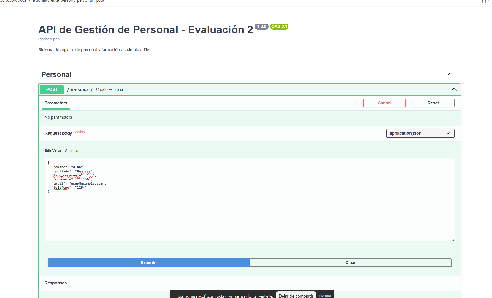
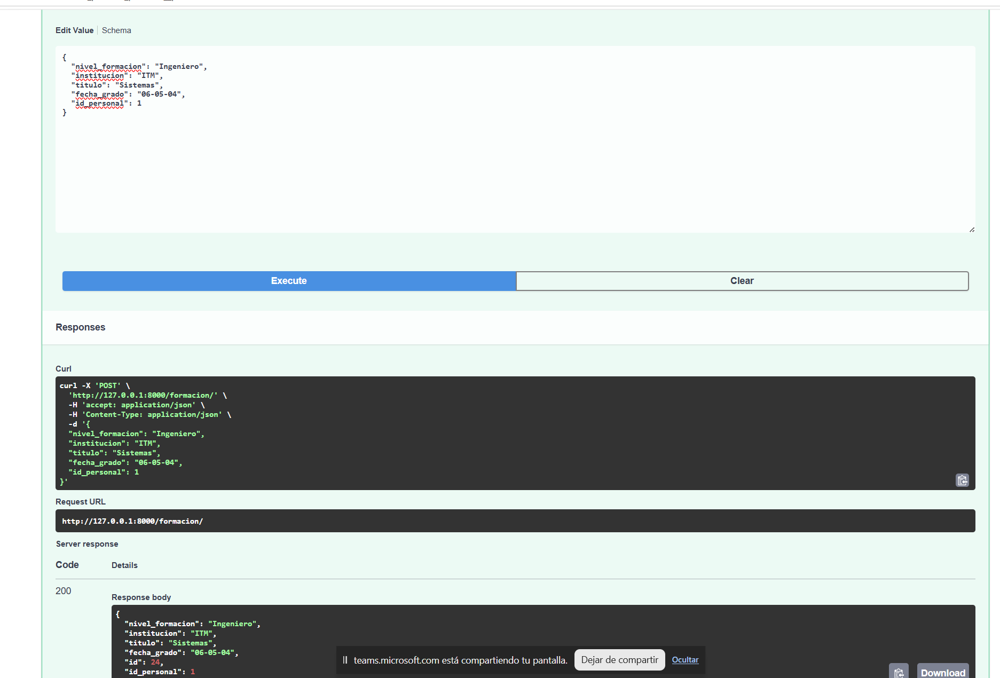

# Taller 2: Gestión de Personal y Formación - ITM

## 1. Información General
* **Integrantes:** 
    > - Diego Alejandro Giraldo Bolivar
    > - Julian David Velez Arango
    > - Jorge Andres Vidal Ramirez
                   
* **Asignatura:** Aplicaciones y Servicios Web
* **Fecha:** Abril 2026

## 2. Descripción de la Arquitectura
El proyecto sigue una arquitectura modular por capas:
* **models**: Definición de tablas en SQLAlchemy.
* **schemas**: Validación de datos con Pydantic.
* **crud**: Lógica de interacción con la base de datos.
* **api**: Endpoints de la aplicación (routers).
* **db**: Configuración de la conexión y sesiones.

## 3. Modelo de Datos
Se implementaron dos entidades principales relacionadas:

### Entidad: Personal
Representa la información básica de los integrantes.
* *Campos clave:* id, nombre, apellido, documento (único), email.
* *Schema:* grupo_3

### Entidad: Formación
Registra la trayectoria académica de cada persona.
* *Relación:* Llave foránea id_personal vinculada a la tabla personal.
* *Integridad:* Se configuró eliminación en cascada para evitar registros huérfanos.

## 4. Validación de Datos (Schemas)
Se utiliza *Pydantic* para la validación y serialización de datos:

* *Contratos de Entrada:* Se definen esquemas Create y Update para restringir qué campos puede enviar el cliente (por ejemplo, el cliente no puede definir el id manualmente).
* *Contratos de Salida:* Los esquemas de respuesta formatean los objetos de base de datos a JSON, incluyendo relaciones anidadas (un objeto Personal incluye su lista de formaciones).
* *Tipado Fuerte:* Uso de EmailStr para garantizar la integridad de los correos electrónicos desde el nivel de aplicación.

## 5. Lógica de Persistencia (CRUD)
Se implementó un patrón de repositorio en la carpeta `app/crud/` para desacoplar la base de datos de los endpoints:

* **Abstracción:** Los archivos `personal.py` y `formacion.py` contienen funciones puras de SQLAlchemy que reciben una sesión de base de datos (`Session`) y los datos validados por Pydantic.
* **Actualizaciones Parciales:** Se utiliza la funcionalidad de Pydantic para permitir actualizaciones de campos específicos sin requerir el objeto completo, optimizando las peticiones PATCH/PUT.
* **Gestión de Sesiones:** Se asegura el uso de `db.refresh()` tras cada inserción para devolver al cliente el objeto final con los IDs generados por PostgreSQL.

## 6. Ejecución y Documentación
La API implementa documentación automática mediante Swagger UI.

### Pasos para ejecutar:
1. Asegúrese de tener el entorno virtual activo.
2. Ejecute el servidor con Uvicorn:
   ```bash
   uvicorn app.main:app --reload

### Pruebas Finales:
* Post Persona



* Post Formacion

